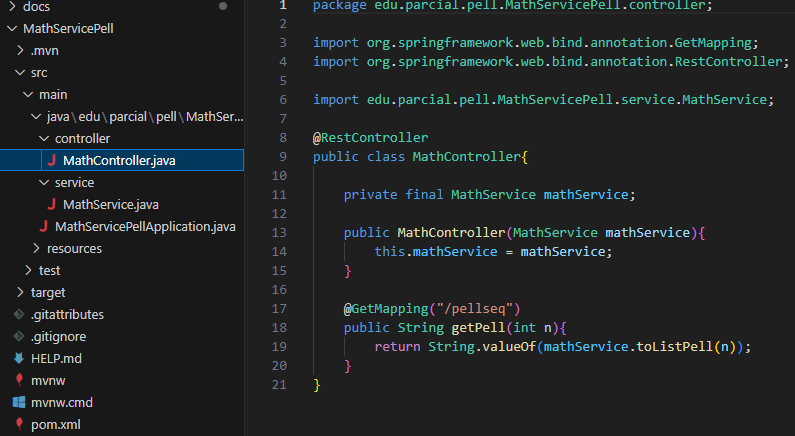
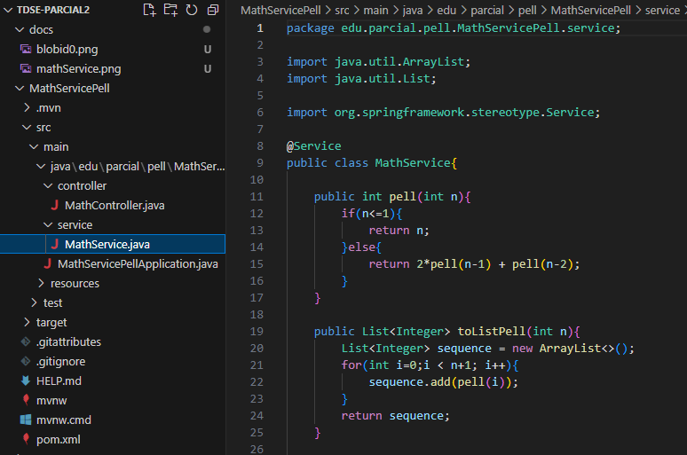
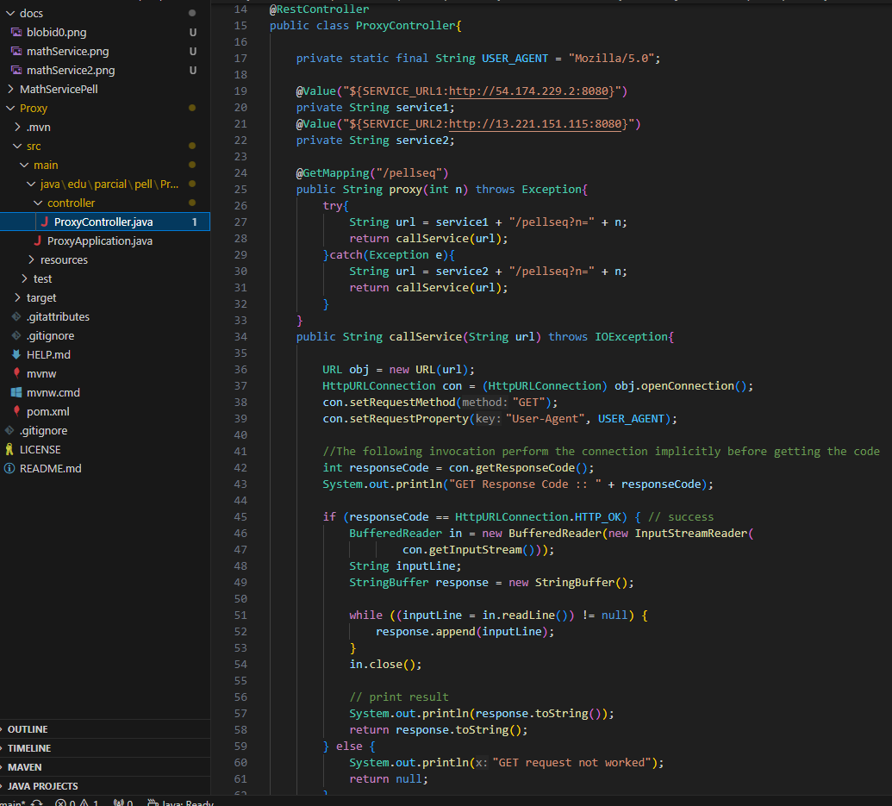
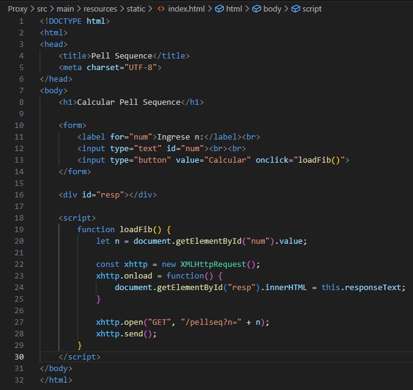
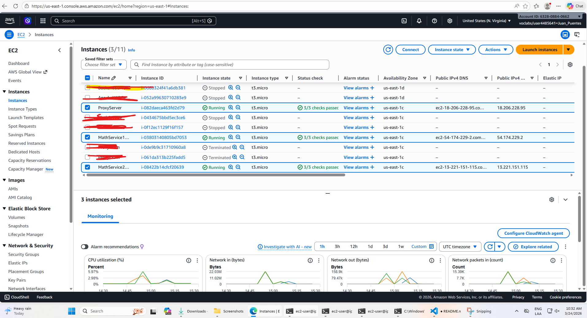
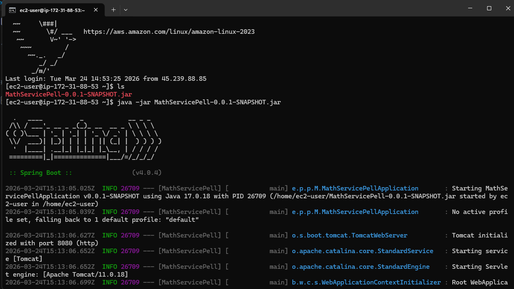
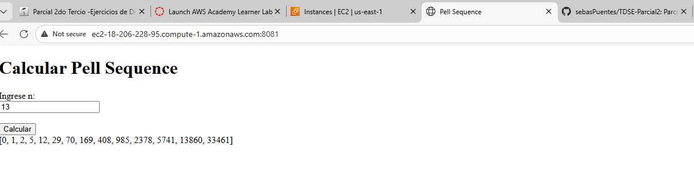

# TDSE-Parcial2
Parcial 2
## Arquitectura Propuesta

Se tiene un proxy que redirige las peticiones hacia dos servidores que contienen el math service funcionado (Pell Sequence)

## Implementacion

- Math Service: Este Repositorio es el encargado de realizar el calculo matemático de la secuencia de pell. Se realiza un controlador y servicio para este caso.

Controlador:

Servicio:

- Proxy: Encargado de redireccionar peticiones.

Controlador:

Se hace uso HttpURLConnection para llamar al servicio correspondiente. En este caso mathService.

## Formulario
Dentro de resources en la carpeta static crearemos un index.html para el formulario junto con la llamada asincrona dado por el profesor.

## Despliegue AWS

1. Crear la Respectivas instancias en aws. En este caso 2 para math service y 1 para el proxy.

2. Instalar Java usando el siguiente comando "sudo yum install java-17-amazon-corretto-devel".

3. Ejecutar en cada repositorio el comando "mvn clean install" para que genere el .jar correspondiente. Haciendo uso del protocolo sftp subiremos este a las respectivas instancias. 

4. Haciendo uso del comando java -jar nombreJAt.jar correremos el proyecto.

Ejemplo en Math Service 1:

5. Abrir los puertos en cada instancia.

## Evidencia Funcionamiento

## Autor

- Juan Sebastian Puentes Julio
